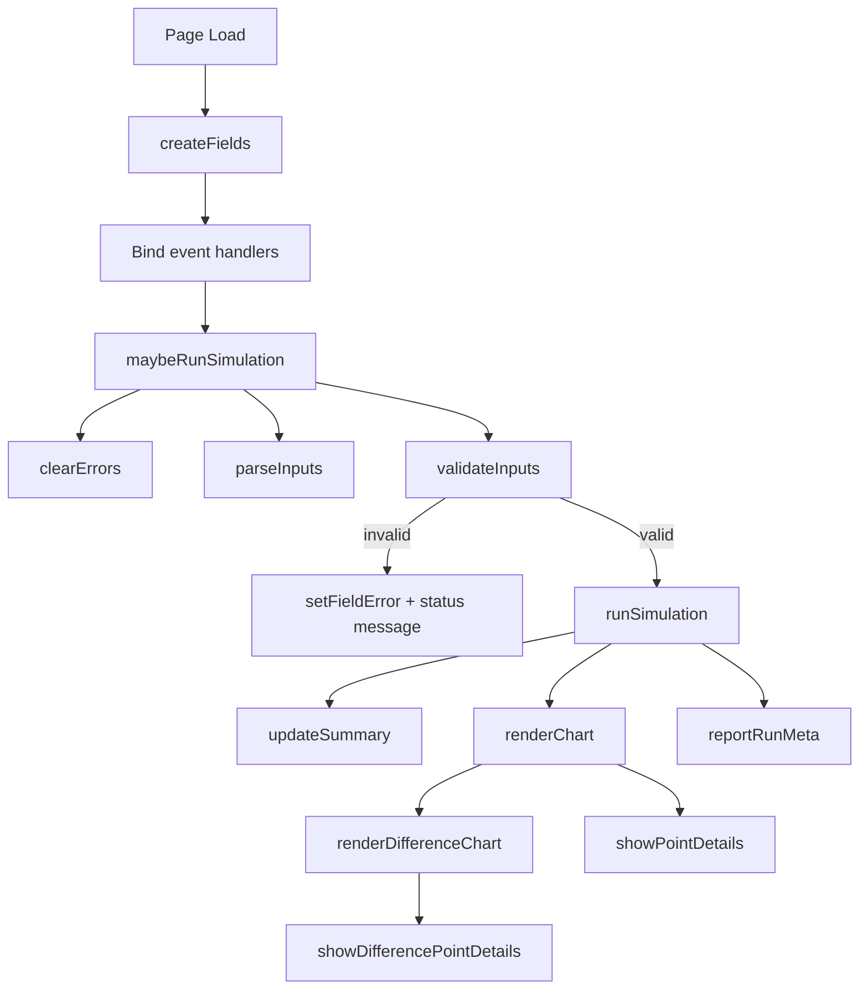
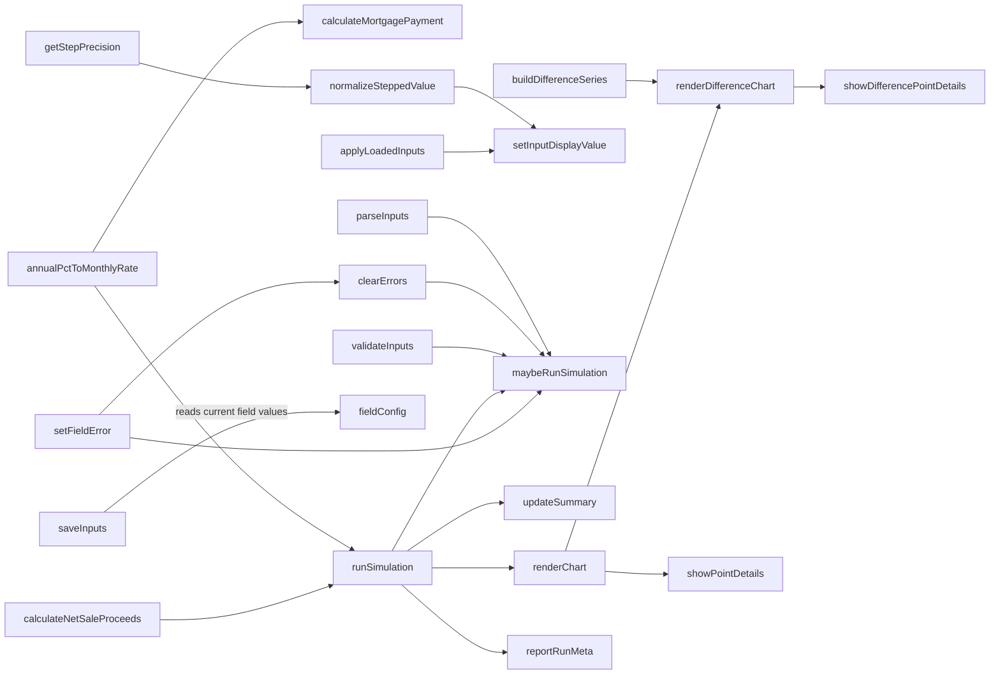
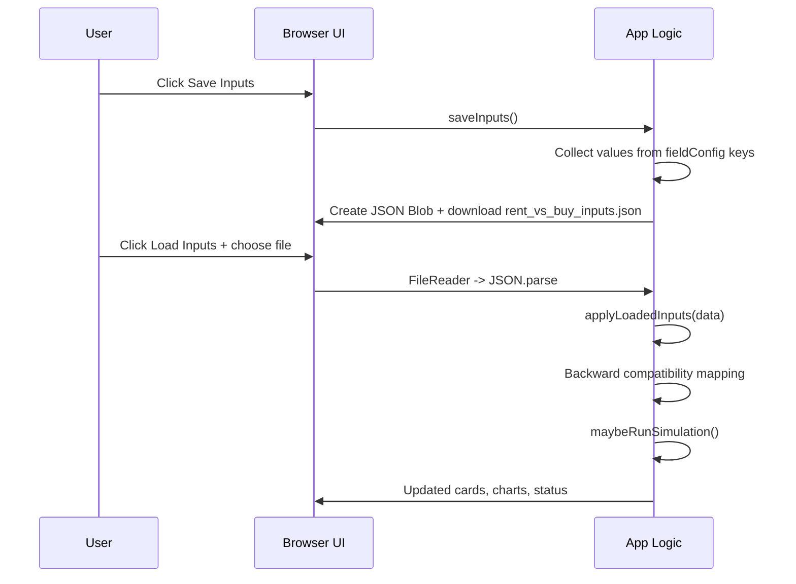

# Rent vs Buy Simulator: Design Overview

## 1. Language, Runtime, and Libraries

- Primary language: JavaScript (ES6+) embedded in a single HTML file.
- Markup: HTML5.
- Styling: CSS3 (custom properties, responsive grid, lightweight animations).
- Charting library: Chart.js loaded from CDN.
- Data persistence: Browser APIs (`Blob`, `URL.createObjectURL`, `FileReader`) for save/load JSON.
- Deployment style: Static client-side app with no server dependency.

## 2. UI Theme and Visual Design

### Theme direction

The UI uses a warm paper-like base with natural green and amber accents:

- Background layers: radial + linear gradients for depth.
- Surface style: soft cards (`--paper`), rounded corners (`--radius`), drop shadows (`--shadow`).
- Typography pairing:
  - Heading: Source Serif 4 (editorial, high contrast).
  - Body/UI: Space Grotesk (clean, modern, readable).

### Color tokens (CSS variables)

- `--bg`: page background tone.
- `--paper`: panel/card background.
- `--ink`: primary text.
- `--muted`: secondary text.
- `--accent`: primary green action color.
- `--accent-2`: amber highlight for winner callout.
- `--danger`: validation/error state.
- `--line-rent`, `--line-buy`: chart series colors.

### Key UI elements

- Input panel:
  - Dynamic field grid generated from `fieldConfig`.
  - Native numeric steppers (`input[type="number"]`) with per-field step values.
  - Help toggle button (`?`) per field with contextual explanation text.
  - Inline field-level validation messages.
- Action row:
  - Save Inputs (export JSON).
  - Load Inputs (import JSON).
  - Live status text.
- Results panel:
  - Three metric cards (rent final, buy final, delta).
  - Winner banner summary.
  - Two charts:
    - Net worth by year.
    - Difference by year (Buy - Rent).
  - Hover/click detail lines under each chart.

### Responsive behavior

- Desktop (`min-width: 960px`): two-column layout (inputs + results).
- Mobile (`max-width: 740px`): single-column fields and stacked summary cards.

## 3. Program Structure (High-Level)

The app is intentionally structured as a single-file architecture:

1. Constants and configuration:
   - Domain constants (selling cost, inflation assumption).
   - `fieldConfig` for input schema + defaults + UX copy.
2. UI references:
   - Cached DOM handles in `ui` object.
3. Utility layer:
   - Rate conversion, mortgage math, formatting helpers.
4. Validation and parsing:
   - Read user inputs, enforce constraints, emit field errors.
5. Simulation engine:
   - Month-by-month state update for rent and buy scenarios.
6. Presentation layer:
   - Summary cards and chart rendering/updating.
7. Persistence and bootstrapping:
   - Save/load JSON + backward-compat mapping + initial run.

## 4. Core Data Model

### Input model (`fieldConfig`)

Each field object defines:

- `key`: source-of-truth property name used across parse/validate/simulate.
- `label`: UI name.
- `step`: spinner increment size.
- `default`: initial value.
- `help`: per-field explanatory text.

Important renamed/updated fields:

- `monthlyHousingAllocation` (formerly `monthlyIncome`).
- `annualMaintenance` in dollars (formerly percentage-based maintenance).

### Simulation outputs

`runSimulation` returns:

- `years`: `[0..N]` yearly points.
- `rentSeries`: rent-path net worth by year.
- `buySeries`: buy-path net worth by year.

Difference series is derived by:

- `buildDifferenceSeries(results)` -> `buySeries[i] - rentSeries[i]`.

## 5. Financial Modeling Rules Implemented

### Time and compounding

- Simulation time step: monthly.
- Annual growth assumptions are converted to monthly rates for stock/mortgage math.
- Yearly growth factors are applied once per year for:
  - Rent growth.
  - Home value growth.
  - Assessed value growth cap.

### Inflation assumptions

`ANNUAL_HOUSING_INFLATION_RATE = 0.02` (2%) is applied yearly to:

- Monthly insurance (derived from annual insurance input).
- Monthly HOA cost.
- Monthly maintenance (derived from annual maintenance input).

### Cash flow treatment

- Monthly contributions can be negative (drawdown), not clamped to zero.
- This avoids an artifact where costs stop hurting while tax refunds still accrue.

### Buy-specific mechanics

- 30-year fixed mortgage amortization.
- Property tax based on assessed value growth cap.
- End-of-year tax refund:
  - `taxRefund = (annualMortgageInterest + annualPropertyTaxPaid) * taxBracketPct`.
- Exit valuation includes fixed 5% selling closing cost.

## 6. Function Relationship Map

## 6.1 Primary control flow

## 6.2 Function dependency graph

## 6.3 Input save/load flow

## 7. Event and Interaction Design

- Every numeric input listens to both `input` and `change` events.
- Any valid value change triggers immediate re-simulation.
- Invalid states are non-destructive:
  - Simulation does not run.
  - Field-level errors are shown.
  - Existing chart/results remain until valid inputs return.
- Chart interaction supports both hover and click point inspection.
- Chart updates use `chart.update("none")` to avoid animated transitions on rerun.

## 8. Validation Strategy

Validation is centralized in `validateInputs(v)`:

- Numeric presence for all fields.
- Domain constraints:
  - Non-negative values (except years integer logic).
  - `years` must be positive integer.
  - `taxBracketPct` in `[0, 100]`.
  - `downPayment <= purchasePrice`.
  - `monthlyHousingAllocation >= max(monthlyRent, startup monthly ownership cost)`.

This ensures the simulation engine receives consistent, safe input.

## 9. Design Decisions That Support Future Modifications

### Why dynamic field generation?

Using `fieldConfig` + `createFields()` means most input changes are schema-first:

- Add/remove fields in one place.
- Keep labels/help/steps/defaults coupled with key names.
- Automatically get rendering, parsing, save/load, and validation wiring patterns.

### Why monthly simulation instead of yearly?

Monthly granularity supports:

- Realistic mortgage amortization.
- Monthly contribution logic.
- Smooth transitions between annual assumption updates.

### Why keep charts as derived presentation?

The simulation returns pure arrays (`years`, `rentSeries`, `buySeries`), and charts are render-only consumers. This separation makes it easier to:

- Add additional visualizations.
- Add CSV export.
- Add comparative scenarios without rewriting core math.

## 10. Practical Modification Guide

### A. Add a new input

1. Add item to `fieldConfig` with `key`, `label`, `step`, `default`, `help`.
2. Update `validateInputs` for domain checks.
3. Consume the new key in `runSimulation` if it affects math.
4. Optionally add backward compatibility in `applyLoadedInputs` for legacy files.

### B. Change a formula

1. Update math in `runSimulation`.
2. Keep units consistent (annual vs monthly) before mixing terms.
3. Ensure yearly updates happen in the annual update block.
4. Verify summary and both charts still align with the same data arrays.

### C. Change UI look-and-feel

1. Edit CSS variables in `:root` for global palette shifts.
2. Adjust component-level classes (`.panel`, `.card`, `.winner`, `.chart-wrap`).
3. Preserve focus and error states for accessibility.

### D. Extend persistence format safely

1. Continue writing canonical current keys in `saveInputs`.
2. Add key migration in `applyLoadedInputs` for older files.

## 11. Known Constraints and Trade-offs

- Single-file architecture is easy to inspect but can grow large over time.
- No test harness is embedded in this file (manual verification currently required).
- Input values are numeric and direct; no locale-aware number parsing layer is added.
- Tax refund treatment is simplified for scenario comparison and not a full tax engine.

## 12. Suggested Next Refactor (Optional)

If you plan larger changes, split into modules:

- `config.js`: constants + field definitions.
- `model.js`: validation + simulation functions.
- `ui.js`: rendering and events.
- `persistence.js`: save/load + migrations.

This preserves current behavior while making future contributions easier to test and maintain.
